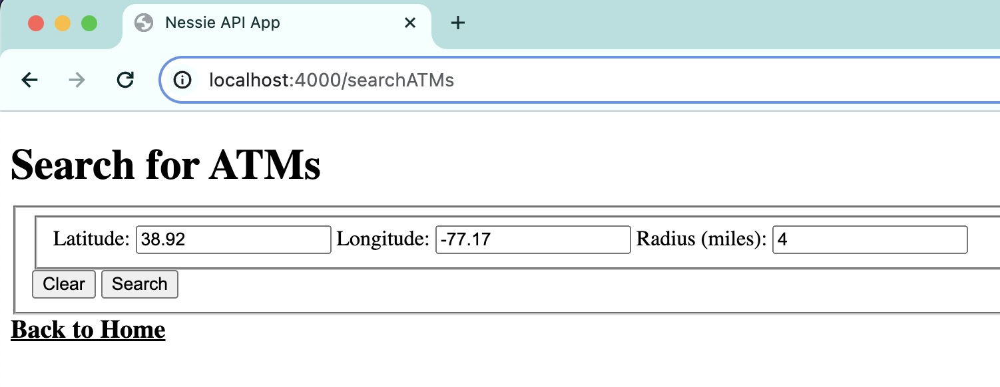

# Nessie API App

Install required packages with `npm install`.
To run locally: `node server.js` or `npm start`
Runs locally on Port 4000.

## Get ATMs
### Endpoint Used: GET /atms

Fill out form to create new request to get ATMs.

Result will display list of ATMs in given range and how many pages were found in response.

## Get Nessie's Customer Profile
### Endpoint Used: GET /customers/\{id\}

Pages displays details about customer "Nessie" from API.

## Add New Account
### Endpoint Used: POST /customers/\{id\}/accounts

Fill out form with details for new account.

Result shows response from request with information about new account.

## Add New Bill
### Endpoint Used: POST /accounts/\{id\}/bills

Fill out form with details for new bill to a credit card account.

Result shows response from request with information about new bill.

## Add New Purchase
### Endpoint Used: POST /accounts/\{id\}/purchase

Fill out form with details for purchase from a credit card account to merchant Apple.

Result shows response from request with information about new purchase.

## Add New Transfer
### Endpoint Used: POST /accounts/\{id\}/transfer

Fill out form with details for new transfer from credit card account to savings account.

Result shows response from request with information about new transfer.

## Get Credit Card Account Information
### Endpoint Used: GET /enterprise/accounts/\{id\}

Pages displays details about credit card account from enterprise endpoint view.

## View and Delete Purchases
### Endpoints Used: 
- GET /accounts/\{id\}/purchases
- DELETE /data (type: Purchases)

View list of purchases made. Click button to delete all purchases.

Result shows confirmation that data has been cleared.
